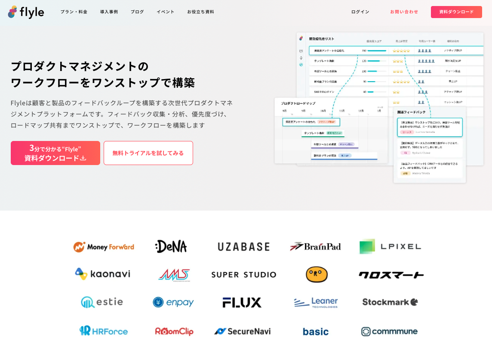
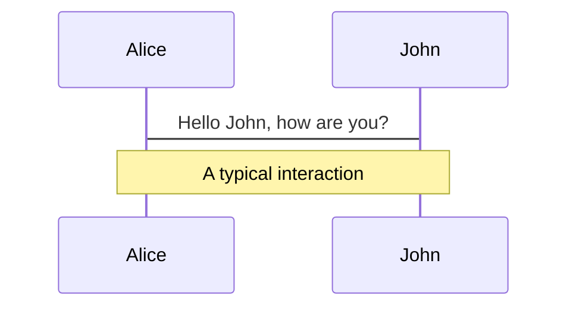
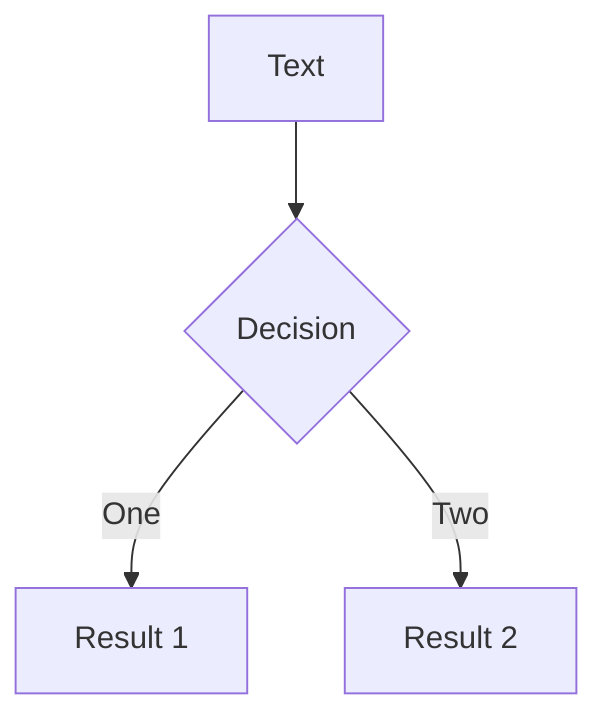
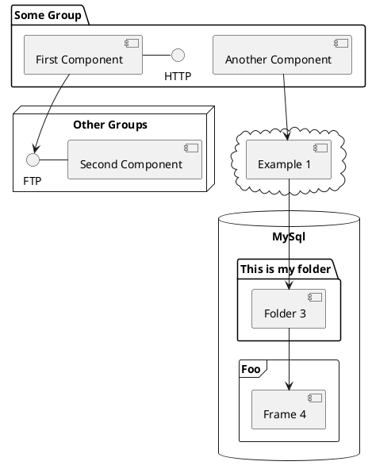

# Kvelte
## ~ Use Svelte From Kotlin ~

baseballyama

<div class="abs-br m-6 flex gap-2">
  <a href="https://github.com/baseballyama" target="_blank" alt="GitHub"
    class="text-xl icon-btn opacity-50 !border-none !hover:text-white">
    <carbon-logo-github />
  </a>
</div>
---

<div class="flex items-center justify-center h-1/1">
  <h1>History of Web Frameworks</h1>
</div>
---

# History of Web Frameworks

<p>
  199x - Everything started from here
</p>


<div class="flex gap w-1/1">
  <div class="w-7/10">
  <h2>The Beginning of the World</h2>
  <br />

  - <logos-html5 /> 1993 - First version of HTML released.
  - <logos-css3 /> 1994 - published the first draft of the CSS.
  - <logos-javascript /> 1995 - published the new scripting language called Mocha, which eventually became known as JavaScript.
  </div>

  <div class="w-3/10 flex flex-col items-center !opacity-70">
    
    <span class="mt-2">Tim Berners-Lee</span>
  </div>
</div>

<p class="!mt-0">
  <a class="text-xs" target="_blank" rel="noopener noreferrer" href="https://devdojo.com/tnylea/a-brief-history-of-web-development">
    https://devdojo.com/tnylea/a-brief-history-of-web-development
  </a>
</p>
---

# History of Web Frameworks

<p>
  200x - Building dynamic HTML on server side
</p>
  
<div class="flex gap w-1/1">
  <div class="w-7/10 pr-4">
  <h2>Server Side Rendering</h2>
  <br />

  - <logos-php /> 1995 - PHP. Personal Home Page.
  - <logos-java /> 1996 - Java Servlet is released. In 1999, JSP is released.
  - <logos-java /> 2001 - Apache Struts is released. / 2002 - SPring is released.
  - <logos-ruby /> 2005 - Ruby is an interpreted, high-level, general-purpose programming language.
  - <logos-python /> 2005 - Django was rising in popularity.
  - <logos-go /> 2009 - Go is a statically typed, compiled programming language designed at Google by Robert Griesemer, Rob Pike, and Ken Thompson.
  - <logos-laravel /> 2011 - Taylor Otwell released Laravel
  - <logos-kotlin-icon /> 2011 - Kotlin. Sometimes called better Java.
  </div>

  <div class="w-3/10 flex flex-col items-center !opacity-70">
    
    <span class="mt-2">David Heinemeier Hansson</span>
  </div>
</div>

<span class="!mt-0 mr-4">
  <a class="text-xs" target="_blank" rel="noopener noreferrer" href="https://devdojo.com/tnylea/a-brief-history-of-web-development">
    https://devdojo.com/tnylea/a-brief-history-of-web-development
  </a>
</span>
<span class="!mt-0">
  <a class="text-xs" target="_blank" rel="noopener noreferrer" href="https://speakerdeck.com/michaelisvy/web-frameworks-in-java-10-years-of-history">
    https://speakerdeck.com/michaelisvy/web-frameworks-in-java-10-years-of-history
  </a>
</span>
---

# History of Web Frameworks

<p>
  201x - Faster transitions that make the website feel more like a native app
</p>
  
<div class="flex gap w-1/1">
  <div class="w-7/10 pr-4">
  <h2>SPA / V-DOM / Declarative UI</h2>
  <br />

  - <logos-angular-icon /> 2012 - Google released AngularJS.
  - <logos-react /> 2013 - Meta released React.
  - <logos-vue /> 2014 - 	Evan You  released Vue.js.
  - <logos-preact /> 2015 - Jason Miller released Preact.
  </div>

  <div class="w-3/10 flex flex-col items-center !opacity-70">
    
    <span class="mt-2">Evan You</span>
  </div>
</div>
<!-- Flush has made the website richer. -->
---

# History of Web Frameworks

<p>
  201x - Node.js has significantly developed the JavaScript ecosystem
</p>
  
<div class="flex gap w-1/1">
  <div class="w-7/10 pr-4">
  <h2>JavaScript Ecosystems</h2>
  <br />


  - <logos-nodejs /> 2009 - Node.js is an open-source, cross-platform, back-end JavaScript runtime environment.
  - <logos-express /> 2010 - 	express. Fast, unopinionated, minimalist web framework for node.
  - <logos-typescript-icon /> 2012 - TypeScript is a programming language developed and maintained by Microsoft.
  - <logos-babel /> 2014 - Babel is a free and open-source JavaScript transcompiler.
  - <logos-webpack /> 2014 - Webpack. Free and open-source module bundler for JavaScript.
  - <logos-nextjs-icon /> 2016 - Next.js. Hybrid static & server rendering, TypeScript support, smart bundling, route pre-fetching, and more.
  - <logos-nuxt-icon /> 2016 - Build your next Vue.js application with confidence using Nuxt.
  </div>

  <div class="w-3/10 flex flex-col items-center !opacity-70">
    
    <span class="mt-2">Ryan Dahl</span>
  </div>
</div>
---

# History of Web Frameworks

<p>
  202x - More powerful ecosystem / Virtual DOM is pure overhead
</p>
  
<div class="flex gap w-1/1">
  <div class="w-7/10 pr-4">
  <h2>JavaScript Ecosystem</h2>
  <br />


  - <logos-deno /> 2018 - <logos-rust /> Deno. A modern runtime for JavaScript and TypeScript.
  - <logos-swc /> 2020 - <logos-go /> SWC is an extensible Rust-based platform for the next generation of fast developer tools.
  - <logos-esbuild /> 2020 - <logos-rust /> esbuild. An extremely fast JavaScript bundler.
  - <logos-vitejs /> 2020 - <logos-typescript-icon /> Vite. Next Generation Frontend Tooling.

<br/>

  - <logos-svelte-icon /> 2016 - <logos-typescript-icon /> Svelte is a new way to build web applications.
  - <logos-svelte-icon /> 2020 - <logos-typescript-icon /> SvelteKit is a framework for building web applications of all sizes.
  - <logos-solidjs-icon /> 2021 - <logos-typescript-icon /> Solid is a declarative JavaScript library for creating user interfaces.
  </div>

  <div class="w-3/10 flex flex-col items-center !opacity-70">
    
    <span class="mt-2">RIch Harris</span>
  </div>
</div>
---

<div class="flex items-center justify-center h-1/1">
  <h1>Thinking about best tech stack</h1>
</div>
---

# Backend development

<p>
  My choice is Kotlin
</p>

- Node.js / Deno / Bun will continue to grow.
- However, the performance of JS / TS is currently not as fast as server-side languages e.g. Rust / C / Go / Kotlin.
- JS / TS has relatively few stable libraries due to its short history.
- Kotlin has many stable libraries that have been built up since the Java era
- Go is popular now, but it is still a young language and may risky to use, especially for startups.

---

# Frontend development

<p>
  I am against all existing options
</p>

### ❌ Template Engine (e.g. JSP)

Template engines can be difficult to develop a rich UX like native apps.

### ❌ SPA ✖️ API

SPA is outdated. Initial loading costs are too high.
<br />
Current best practice is between SPA and MPA.

### ❌ (Next.js / Nuxt / etc) ✖️ API

Communicate with Kotlin via HTTP using Next.js / Nuxt / etc.<br />
I will make more issues. (e.g. how to get interface consistency between them.) <br />
Infrastructure management cost is also heavy. (e.g. How to manage version consistency between them.)

---

<div class="flex items-center justify-center h-1/1">
  <h1>My Choice is Svelte over Kotlin</h1>
</div>
---

<section class="flex flex-col items-center justify-center h-1/1">
  <div class="flex flex-col items-center h-1/1 mb-4">
    <div class="w-1/5">
      
    </div>
    <span class="text-3xl mt-4 text-xl">baseballyama</span>
  </div>
  <div class="flex w-1/1">
    <div class="w-1/2">
      
    </div>
    <div class="w-1/2 ml-12">
      <ul>
        <li>Software Engineer <a href="https://flyle.io/jp" target="_blank" rel="noopener noreferrer">@Flyle</a></li>
        <li>Maintainer / Team member of <a href="https://svelte.dev/" target="_blank" rel="noopener noreferrer">Svelte</a></li>
        <li>Kotlin / Spring Boot / Vue.js / MySQL</li>
        <li><a href="https://twitter.com/baseballyama_" target="_blank" rel="noopener noreferrer">Twitter</a></li>
        <li><a href="https://github.com/baseballyama" target="_blank" rel="noopener noreferrer">GitHub</a></li>
      </ul>
    </div>
  </div>
</section>

---

# Frontend development

<p>
  My Choice is Svelte over Kotlin
</p>

### ❌ Template Engine (e.g. JSP)

Template engines can be difficult to develop a rich UX like native apps.

### ❌ SPA x API

SPA is outdated. Initial loading costs are too high.
<br />
Current best practice is between SPA and MPA.

### ❌ (Next.js / Nuxt / etc) x API

Communicate with Kotlin via HTTP using Next.js / Nuxt / etc, is heavyweight development stack.
Infrastructure management is also a heavyweight.

---

# Navigation

Hover on the bottom-left corner to see the navigation's controls panel, [learn more](https://sli.dev/guide/navigation.html)

### Keyboard Shortcuts

|     |     |
| --- | --- |
| <kbd>right</kbd> / <kbd>space</kbd>| next animation or slide |
| <kbd>left</kbd>  / <kbd>shift</kbd><kbd>space</kbd> | previous animation or slide |
| <kbd>up</kbd> | previous slide |
| <kbd>down</kbd> | next slide |

<!-- https://sli.dev/guide/animations.html#click-animations -->

<p v-after class="absolute bottom-23 left-45 opacity-30 transform -rotate-10">Here!</p>

---
layout: image-right
image: https://source.unsplash.com/collection/94734566/1920x1080
---

# Code

Use code snippets and get the highlighting directly![^1]

```ts {all|2|1-6|9|all}
interface User {
  id: number
  firstName: string
  lastName: string
  role: string
}

function updateUser(id: number, update: User) {
  const user = getUser(id)
  const newUser = { ...user, ...update }
  saveUser(id, newUser)
}
```

<arrow v-click="3" x1="400" y1="420" x2="230" y2="330" color="#564" width="3" arrowSize="1" />

[^1]: [Learn More](https://sli.dev/guide/syntax.html#line-highlighting)

<style>
.footnotes-sep {
  @apply mt-20 opacity-10;
}
.footnotes {
  @apply text-sm opacity-75;
}
.footnote-backref {
  display: none;
}
</style>

---

# Components

<div grid="~ cols-2 gap-4">
<div>

You can use Vue components directly inside your slides.

We have provided a few built-in components like `<Tweet/>` and `<Youtube/>` that you can use directly. And adding your custom components is also super easy.

```html
<Counter :count="10" />
```

<!-- ./components/Counter.vue -->
<Counter :count="10" m="t-4" />

Check out [the guides](https://sli.dev/builtin/components.html) for more.

</div>
<div>

```html
<Tweet id="1390115482657726468" />
```

<Tweet id="1390115482657726468" scale="0.65" />

</div>
</div>


---
class: px-20
---

# Themes

Slidev comes with powerful theming support. Themes can provide styles, layouts, components, or even configurations for tools. Switching between themes by just **one edit** in your frontmatter:

<div grid="~ cols-2 gap-2" m="-t-2">

```yaml
---
theme: default
---
```

```yaml
---
theme: seriph
---
```


</div>

Read more about [How to use a theme](https://sli.dev/themes/use.html) and
check out the [Awesome Themes Gallery](https://sli.dev/themes/gallery.html).

---

# Animations

Animations are powered by [@vueuse/motion](https://motion.vueuse.org/).

```html
<div
  v-motion
  :initial="{ x: -80 }"
  :enter="{ x: 0 }">
  Slidev
</div>
```

<div class="w-60 relative mt-6">
  <div class="relative w-40 h-40">
    
    
    
  </div>

  <div
    class="text-5xl absolute top-14 left-40 text-[#2B90B6] -z-1"
    v-motion
    :initial="{ x: -80, opacity: 0}"
    :enter="{ x: 0, opacity: 1, transition: { delay: 2000, duration: 1000 } }">
    Slidev
  </div>
</div>

<!-- vue script setup scripts can be directly used in markdown, and will only affects current page -->
<script setup lang="ts">
const final = {
  x: 0,
  y: 0,
  rotate: 0,
  scale: 1,
  transition: {
    type: 'spring',
    damping: 10,
    stiffness: 20,
    mass: 2
  }
}
</script>

<div
  v-motion
  :initial="{ x:35, y: 40, opacity: 0}"
  :enter="{ y: 0, opacity: 1, transition: { delay: 3500 } }">

[Learn More](https://sli.dev/guide/animations.html#motion)

</div>

---

# LaTeX

LaTeX is supported out-of-box powered by [KaTeX](https://katex.org/).

<br>

Inline $\sqrt{3x-1}+(1+x)^2$

Block
$$
\begin{array}{c}

\nabla \times \vec{\mathbf{B}} -\, \frac1c\, \frac{\partial\vec{\mathbf{E}}}{\partial t} &
= \frac{4\pi}{c}\vec{\mathbf{j}}    \nabla \cdot \vec{\mathbf{E}} & = 4 \pi \rho \\

\nabla \times \vec{\mathbf{E}}\, +\, \frac1c\, \frac{\partial\vec{\mathbf{B}}}{\partial t} & = \vec{\mathbf{0}} \\

\nabla \cdot \vec{\mathbf{B}} & = 0

\end{array}
$$

<br>

[Learn more](https://sli.dev/guide/syntax#latex)

---

# Diagrams

You can create diagrams / graphs from textual descriptions, directly in your Markdown.

<div class="grid grid-cols-3 gap-10 pt-4 -mb-6">







</div>

[Learn More](https://sli.dev/guide/syntax.html#diagrams)


---
layout: center
class: text-center
---

# Learn More

[Documentations](https://sli.dev) · [GitHub](https://github.com/slidevjs/slidev) · [Showcases](https://sli.dev/showcases.html)
